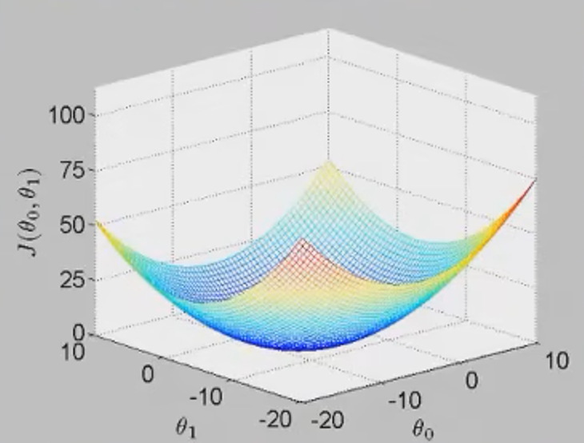
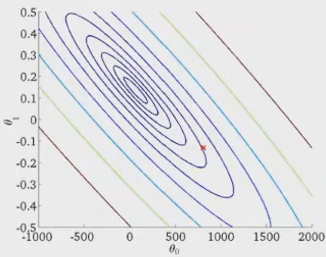

# 线性拟合

## 模型形式
   - 假设函数: $h_{\theta}(x) = \theta_{0} + \theta_{1}x$
   - 参数: $\theta_{0}$ , $\theta_{1}$
   - 代价函数: 均方差之和
   $$ J(\theta_{0}, \theta_{1}) = \frac{1}{2m} \sum_{i = 0}^{m} (h_{\theta}{x^{(i)}} - y^{i})^{2} $$
   , 其中 $m$ 代表训练样本数量.
   - 目标函数: 代价函数最小. $\underset{\theta_{1}, \theta_{2}}{\text{min}} J(\theta_{0}, \theta_{1})$. 需要注意由于代价函数的构造使得每一项都为正, 所以代价函数均大等于0.

## 代价函数
   - 对于每一个参数 $\theta_{0}$ , $\theta_{1}$ 的组合, 代价函数 $J(\theta_{0}, \theta_{1})$ 有其对应值.
   - 代价函数往往是碗装图形, 形如
   
   相对应等高图如图所示
   
   寻找目标函数可以用梯度下降(Gradient descent)算法.

## 梯度下降
   - 步骤
      1. 设置参数初始值: 设 $\theta_{0} = 0$ , $\theta_{1} = 0$
      2. 寻找 $\theta_{0}$ , $\theta_{1}$ 使代价函数减小, 直到寻找到最小值.
   - 更新梯度
   $$ \theta_j := \theta_j - \alpha\frac{\partial}{\partial \theta_j} J(\theta_0, \theta_1)$$
   上式符号 $:=$ 代表赋值, 下标 $j$ 代表参数下标, 符号 $\alpha$ 代表步长, 也称为学习率, 式 $\frac{\partial}{\partial \theta_j} J(\theta_0, \theta_1)$ 代表代价函数在 $\theta_j$ 上的梯度.
   - 注意事项:
      1. *同时*更新: 先计算不同参数的临时变量, 然后再全局更新.
      2. 参数 $\alpha$ 一般不变动, 因为当更新达到局部最优解时, 梯度值为0, $\theta_j$ 不再更新.
      3. 当接近局部最优解时, 梯度绝对值较小, 更新的幅度随之减小.