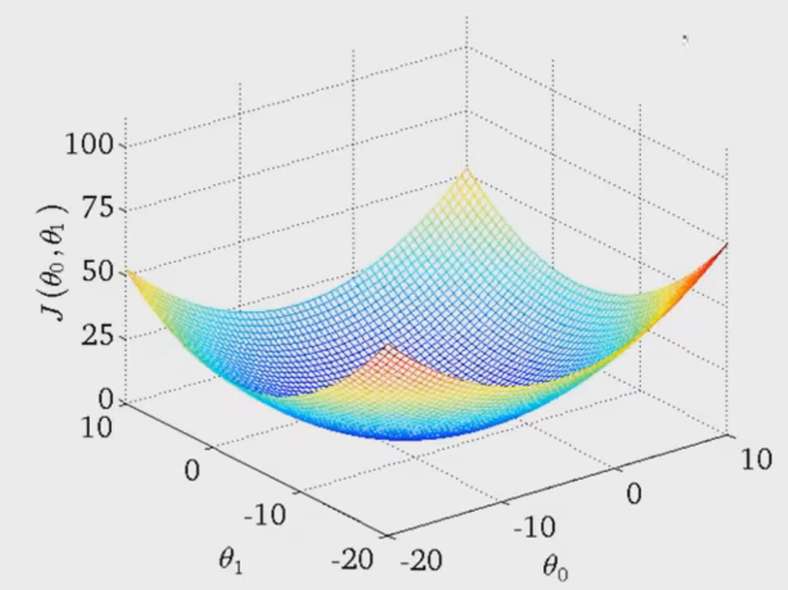

# 线性拟合

## 模型形式
   - 假设函数: $h_{\theta}(x) = \theta_{0} + \theta_{1}x$
   - 参数: $\theta_{0}$ , $\theta_{1}$
   - 代价函数: 均方差之和

   $$J(\theta_{0}, \theta_{1}) = \frac{1}{2m} \sum_{i = 1}^{m} (h_{\theta}{(x^{(i)})} - y^{(i)})^{2}$$

   , 其中 $m$ 代表训练样本数量, 求和从第 $1$ 个训练样本至第 $m$ 个样本. $x^{(i)}$为第 $i$ 个样本的特征, $y^{(i)}$为第 $i$ 个样本的实际值, $h_{\theta}{(x^{(i)})}$ 为第 $i$ 个样本的预测值.
   - 目标函数: 代价函数最小. $\underset{\theta_{1}, \theta_{2}}{\text{min}} J(\theta_{0}, \theta_{1})$. 需要注意由于代价函数的构造使得每一项都为正, 所以代价函数均大等于0.

## 代价函数
   - 对于每一个参数 $\theta_{0}$ , $\theta_{1}$ 的组合, 代价函数 $J(\theta_{0}, \theta_{1})$ 有其对应值.
   - 代价函数图形形如

   

   相对应等高图如图所示
   
   

   寻找目标函数可以用梯度下降(Gradient descent)算法.

## 梯度下降
   - 步骤
      1. 设置参数初始值: 设 $\theta_{0} = 0$ , $\theta_{1} = 0$
      2. 寻找 $\theta_{0}$ , $\theta_{1}$ 使代价函数减小, 直到寻找到最小值.
   - 更新梯度

   $$\theta_j := \theta_j - \alpha \frac{\partial}{\partial \theta_j} J(\theta_0, \theta_1)$$

   上式符号 $:=$ 代表赋值, 下标 $j$ 代表参数下标, 符号 $\alpha$ 代表步长, 也称为学习率, 式 $\frac{\partial}{\partial \theta_j} J(\theta_0, \theta_1)$ 代表代价函数在 $\theta_j$ 上的梯度.
   - 注意事项:
      1. *同时*更新: 先计算不同参数 $\theta$ 的临时变量, 然后再全局更新.
      2. 参数 $\alpha$ 一般不变动, 因为当更新达到局部最优解时, 梯度值为 $0$, 相应的$\theta_j$ 不再更新.
      3. 当接近局部最优解时, 梯度绝对值较小, 更新的幅度随之减小.
      4. *猜测*梯度公式是为了建立步长与梯度的线性关系的经验公式.

## 组合
   将假设函数带入代价函数中, 并于梯度公式结合.

   $$\theta{j} := \theta{j} - \alpha \frac{\partial}{\partial \theta_j} \frac{1}{2m} \sum_{i = 1}^{m} (\theta_{0} + \theta_{1}x^{(i)} - y^{(i)})^{2}$$

   将偏导项展开为

   $$j = 0: \frac{\partial}{\partial \theta_0} J(\theta_0, \theta_1) = \frac{1}{m} \sum_{i = 1}^{m} (\theta_{0} + \theta_{1}x^{(i)} - y^{(i)})$$
   $$j = 1: \frac{\partial}{\partial \theta_1} J(\theta_0, \theta_1) = \frac{1}{m} \sum_{i = 1}^{m} (\theta_{0} + \theta_{1}x^{(i)} - y^{(i)}) \cdot x^{(i)}$$

   代入梯度下降公式, 得到更新公式如下

   $$\theta_0 := \theta_0 - \alpha \frac{1}{m} \sum_{i=1}^{m} (h_{\theta}(x^{(i)}) - y^{(i)})$$
   $$\theta_1 := \theta_1 - \alpha \frac{1}{m} \sum_{i=1}^{m} (h_{\theta}(x^{(i)}) - y^{(i)}) \cdot x^{(i)}$$

   重复上述过程直至收敛.
   上述公式称为Batch梯度下降公式, 线性函数的代价函数往往是凸函数, 只有一个全局最优解.