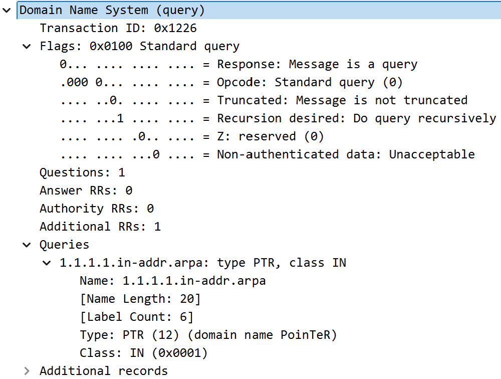

# DNS
   - DNS为应用层协议, 以UDP协议为载体明文传输解析请求. 请求和回复均可以为域名或ip, 根据DNS记录以DNS请求报文查询.

## DNS协议与端口
   - DNS使用UDP协议, 端口号为53, 服务位于互联网边缘. 

## 规范域名与别名
   - DNS解析结果可以是IP地址或另一个域名. 常用别名替代较长的规范域名. 请求也可以是ip地址, 用于反向解析.

## 响应结果的唯一性
   - 同一别名在不同地区可能解析为不同的IP地址或规范域名, 称为地区DNS. DNS响应可能包含多个IP地址, 顺序可能不同. 

## 负载均衡
   - DNS通过轮换IP地址顺序实现负载均衡, 适用于HTTP和SMTP请求. 

## DNS分布结构
   - DNS采用三级分级体系: 根DNS、顶级域名服务器、权威DNS服务器.
   - 请求从根域名服务器逐级查询. 全球约有400台权威DNS服务器, 由13个根域名管理机构管理.
   - 顶级域名通常由公司管理. 权威DNS服务器可由机构自行设置或委托管理.
   - 本地DNS服务器不在分级体系中, 由ISP提供IP地址用于查询, 通常通过DHCP服务生成. 

## DNS响应
   - 根域名服务器提供顶级域名DNS服务器的IP地址. 顶级域名服务器不完全知道所有权威DNS服务器的IP地址. 例如, 查询`cs.zju.com`时, `dns.zju.com`可能返回`dns.cs.zju.com`. 

## 查询模式
   - DNS查询分为递归和迭代查询. 主机到本地DNS的查询通常是递归的, 本地DNS查询是迭代的. 

## DNS记录
   - DNS记录类型
      1. A记录: 主机名::IP地址. 
      2. NS记录: 主机名::主机名（路由转发）. 
      3. CNAME记录: 主机名::规范域名（别名映射）. 
      4. MX记录: 主机名::规范域名（邮件地址）. 

   - 只有权威DNS才能使用A记录, 非权威DNS包含指向权威DNS的NS记录及其对应的A记录. 

## DNS消息结构
   - 前12字节为DNS请求头, 包含标识符、标签Flag、数据数量记录. 
   - 数据: 请求区域、回答区域、权威信息、附加信息. 

   

## 攻击
   - 对DNS服务器: 根域名服务器因防御、缓存、分布式设计不易受攻击. 
   - 对DNS报文: 中间人攻击可对查询的DNS服务器发送虚假回复, 定向至特定网站. 