# TCP
   - TCP通过四元组在不可靠的网络层上提供可靠传输服务, 关键机制包括超时重传和序列号确认等.

## 可靠传输设计过程
   1. 客户端-服务端模式
      - 背景: 信道可靠, 信息无损.
      - 设计: 发送端与接收端分离, 按序传递.
   2. 停止等待协议
      - 背景: 信息可能出现位错误, 需要对数据包进行确认.
      - 设计: 检错 -> 反馈(ACK或NAK) -> 重传
      - 过程: 发送端收到ACK后才能发送下一个包, 否则重传.
      - 问题: 数据或ACK丢失时, 接收端无法区分重发数据与确认.
   3. 交替序列号
      - 设计: 数据包及ACK包使用1-bit序列号交替, 避免NAK请求.
      - 过程: 接收端对校验失败或序列号不符的包, 发送不同序列号的ACK请求重传.
   4. 添加计时器
      - 背景: 信道不可靠, 需要检测和应对包丢失.
      - 设计: 发送方增加计时器, 发送后启动计数器, 超时或响应异常则重传并重置计数器, 直到收到ACK.
   5. 总结
      - 发送方: 使用序列号标识数据包, 超时未确认则重发.
      - 接收方: 校验失败或序列号错误时, 发送不同序列号的ACK请求重传.
   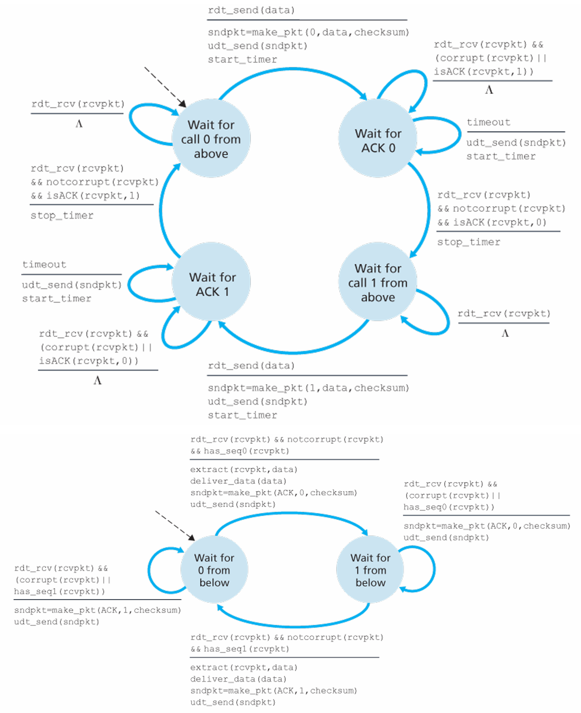

## 传输效率提升
   - 问题: 停止等待协议效率低.
   - 改进: 通过连续发送数据包提升效率, 使用递增序列号和数据缓冲.

### GBN(滑动窗口协议)
   - 方法: 限制未确认数据包的最大数量, 使用累计确认.
   - 数据缓存: `base`为发送端最早未确认序列号, `nextseqnum`为发送端最小未使用序列号, `expectedseqnum`为接受端期望序列号.
   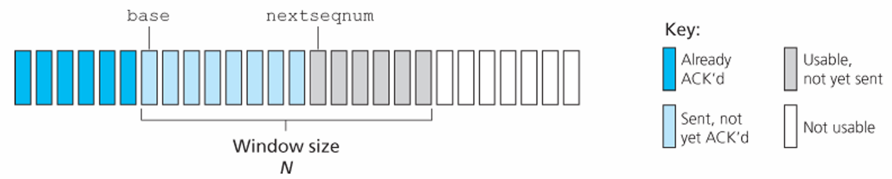
   - 序列号: 使用有限序列号空间, 进行模运算.
   - 发送者过程
      1. 若窗口已满, 拒绝发送; 否则发包并更新nextseqnum, 启动计时.
      2. 若base超时未确认, 重发所有未确认包, 重新计时.
      3. 若ACK异常则等待超时重发, 否则更新base, 重新计时.
   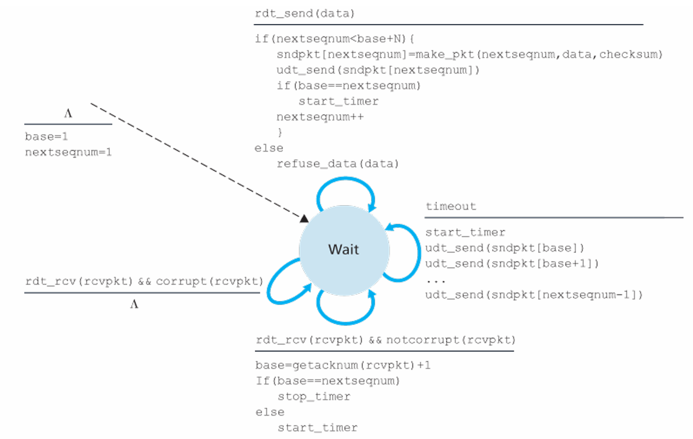
   - 接收者过程
      1. 收到预期数据包向上传递, 更新expectedseqnum.
      2. 其他情况丢弃数据包, 发送上一个成功接收的数据包的ACK.
   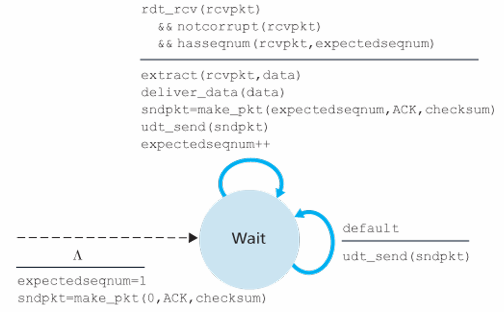

### SR(选择重传协议)
   - 特性: 数据包独立确认, 单独重发.
   - 发送者过程: 数据包独立计时并缓存ACK.
   - 接收者过程: 允许累积回复, 必须回复rcv_base前N个包.
   - 窗口大小N: 必须小于或等于序列号空间的一半.
   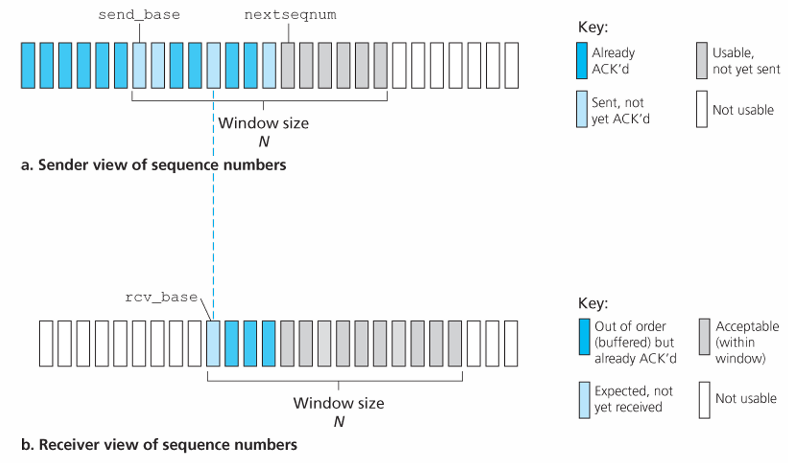

### TCP的可靠传输
   - TCP使用期望接受的下一个字节流编号作为ACK, 采用累计确认和单一计时器.
   - 序列号与确认号:
      - 序列号: TCP段的第一个字节流编号.
      - 确认号: 期望从对方接收的下一个字节的序列号.
      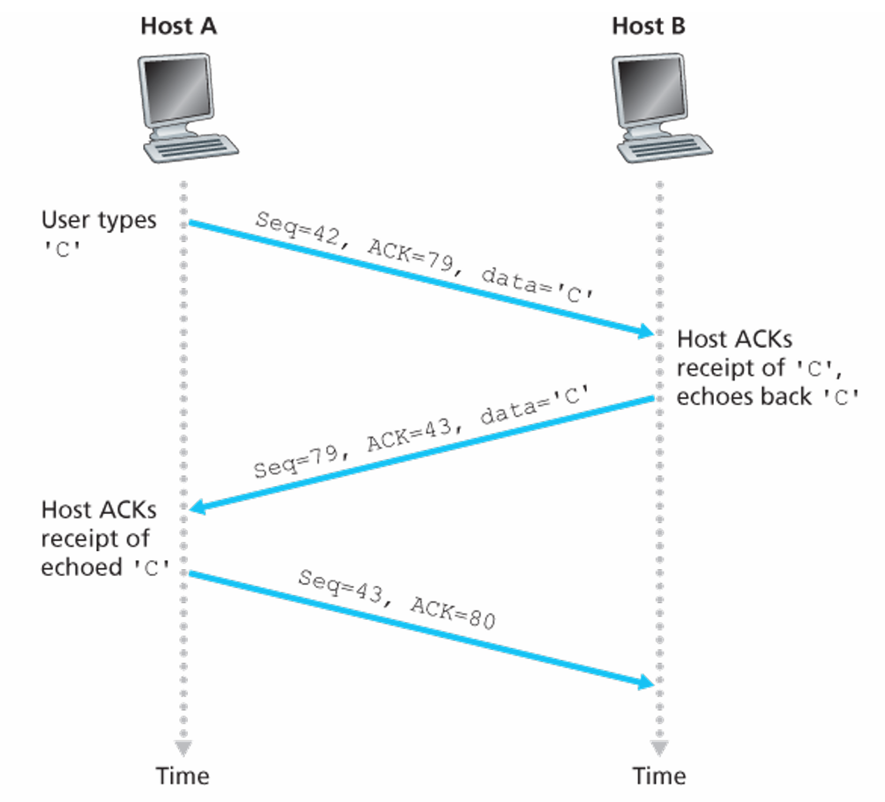
   - 发送者事件:
      1. 应用层调用: 封装并发送.
      2. 超时: 重传未确认的序列号最小的数据包, 重新计时.
      3. 接收ACK: 累积确认, 对额外的3个ACK启动快速重传.
      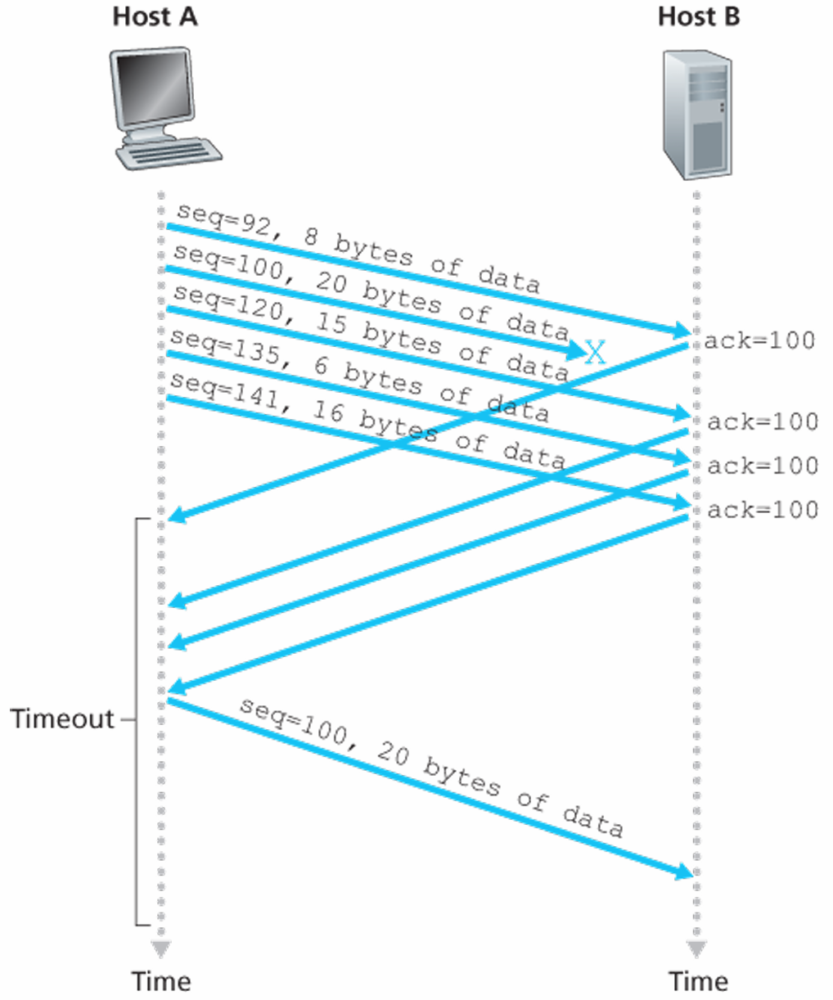
   - 接收者事件:
      1. 顺序包: 延迟确认.
      1. 乱序包: 丢弃, 发送一个期望ACK.
      2. 重发包: 对期望包ACK.

### 区别
   - GBN与SR: SR只重传丢失的数据包, 使用独立计时器, 缓存单个数据包ACK, 允许滑动多个窗口, 支持累积确认.
   - GBN与TCP: TCP对三个ACK快速重传最小未确认包.

## TCP

### 报文
   - 长度: TCP头部20字节, TCP/IP头部40字节, 数据长度称最大段大小MSS.
   - TCP组成: 通信系统两端的缓冲区, 变量, socket构成.
   - 三次握手: 第三次可能承载负载.
   - TCP头部组成
      - 2个16-bit端口
      - 32-bit序列号及确认号
      - 16-bit接收窗口大小
      - 4-bit长度以字长表示
      - 字段flag有6位, ACK指示确认包, RST, SYN, FIN用于连接管理.
      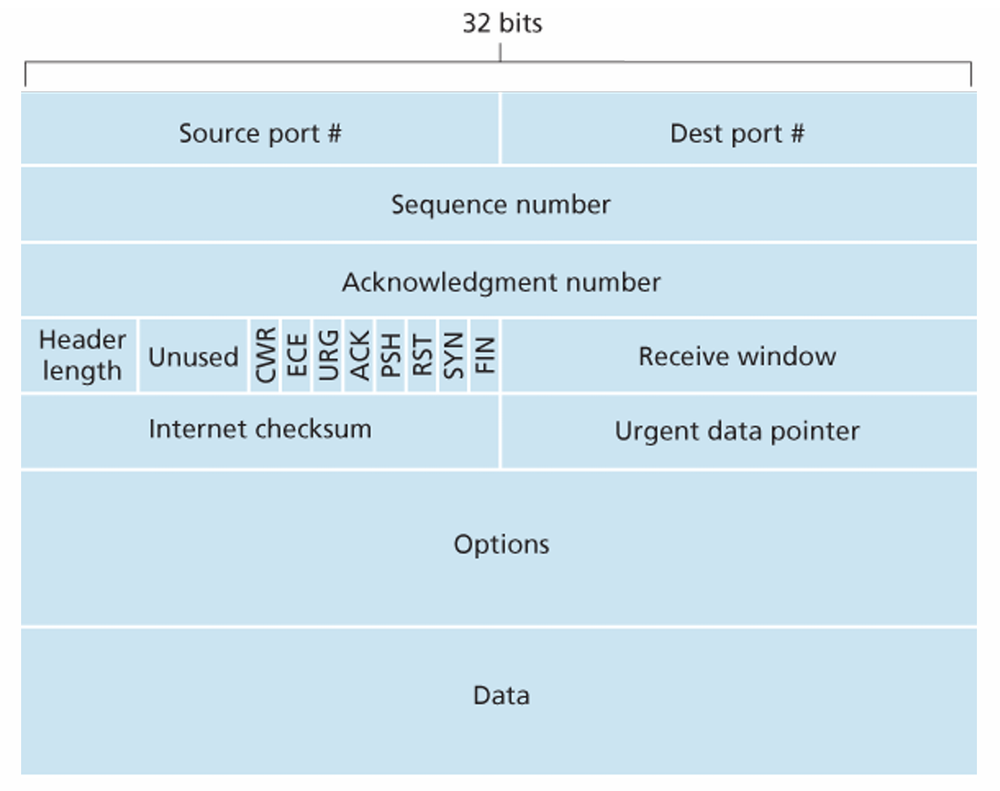

### 延迟测量
   1. sampleRTT: 往返时延的实时测量.
   2. estimateRTT: 与sampleRTT加权平均决定的预估误差, $estimateRTT = (1 - \alpha) * estimateRTT + \alpha * sampleRTT$.
   3. DevRTT: 误差的加权平均, $DevRTT = (1 - \beta) * DevRTT + \beta * |sampleRTT - estimatedRTT|$.
   4. timeoutInterval: 最终计算得到的超时时延, $timeoutInterval = estimatedRTT + 4 * DevRTT$.
   5. 超时发生, timeoutInterval加倍.

### 流量控制
   - 目的: 防止接收缓存不会溢出.
   - 计算
      1. 接收端缓存要求 $RcvBuffer \geq LastByteRcvd - LastByteRead$, 得到接收窗口大小 $rwnd = RcvBuffer - (LastByteRcvd - LastByteRead)$.
      2. 发送端未确认数据要求小于接收端窗口 $LaseByteSent - LastByteAcked \leq rwnd$
   - 窗口为0: *发送方*须继续发送TCP报文探测接收方窗口大小.

### 连接管理
   - 三次握手
      1. SYN: `SYN = 1`, 插入客户端序列号`client_isn`.
      2. SYNACK: `SYN = 1`, 更新ACK, 插入服务端序列号`server_isn`.
      3. ACK: `SYN = 0`, 更新ACK.
   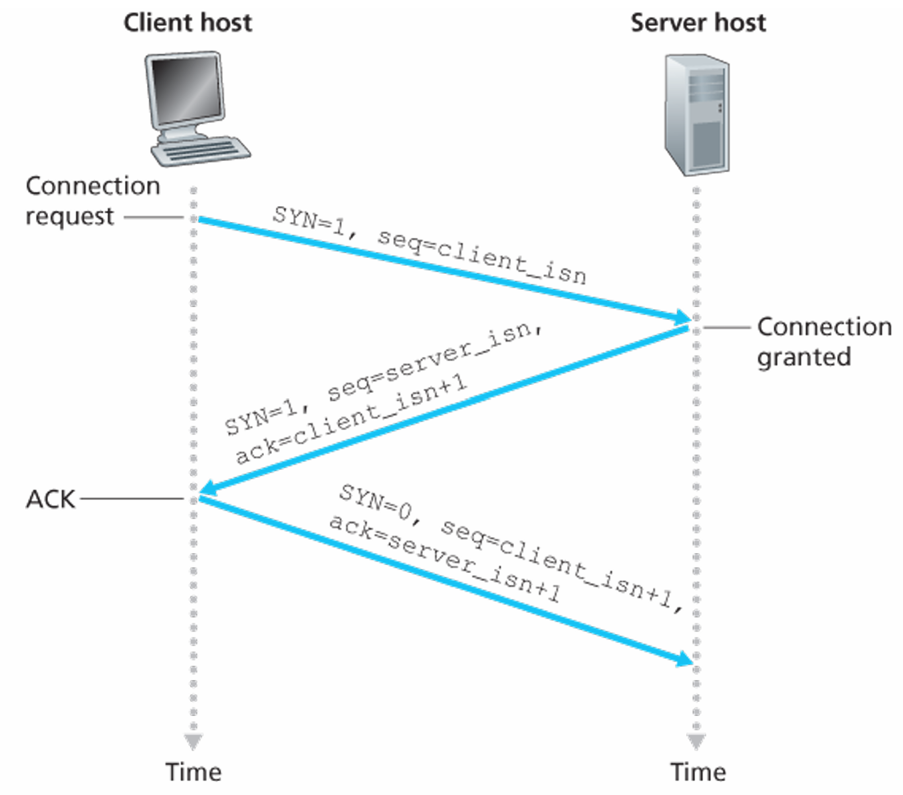
   - 四次挥手
      1. 客户端发送`FIN = 1`, 服务器ACK.
      2. 服务端发送`FIN = 1`, 客户端ACK.
   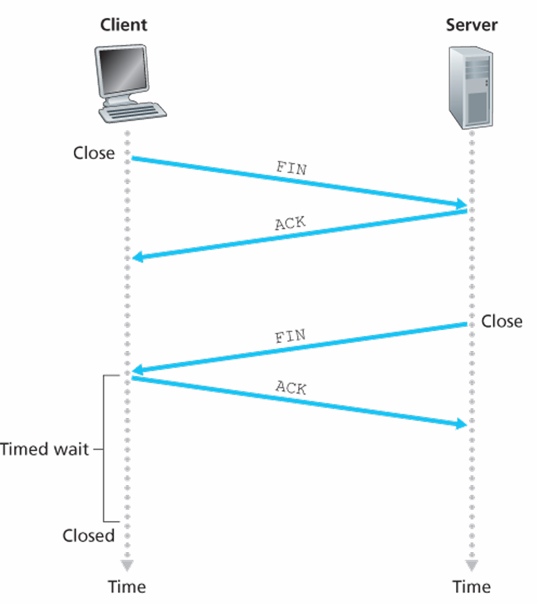
   - 生命周期: 客户端及服务端的建立和终止经历多个状态.
   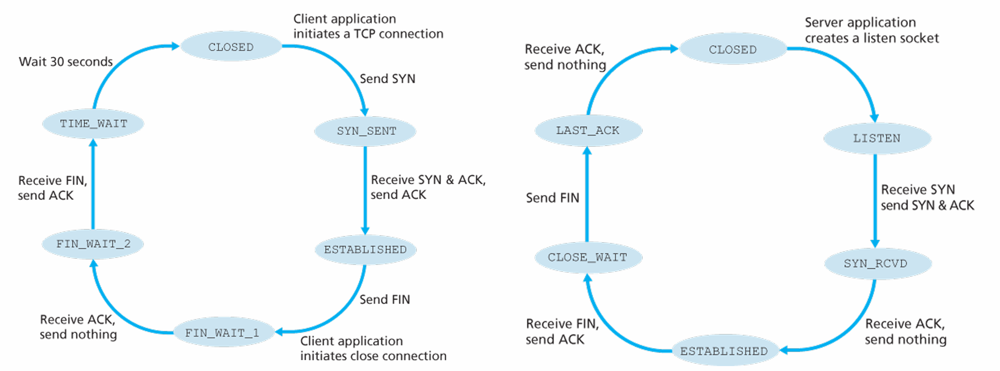
   - 其他情况
      1. 客户端TCP连接到无效端口: 服务端发送`RST = 1`.
      2. 客户端的SYN请求被防火墙拦截, 不会收到任何回复.

### 拥塞控制
   - 限制因素: 网络带宽, 丢失重传, 超时重传, 已传输链路的浪费.
   - 控制方式
      1. 端控制: 检测超时及丢包, 降低窗口大小控制, TCP采用这种方式.
      2. 核心控制: 路由器通过阻塞包告知发送方降低速率, 或标记发往接收方的数据包来通知发送方.
   - 措施: 限制拥塞窗口`cwnd`(未确认包数量), 满足 $LastByteSent - LastByteACKed \leq min{cwnd, rwnd}$.
   - 感知: 确认送达时提高拥塞窗口大小, TCP自计时特性根据确认速度来调节拥塞窗口增加的速度. 若产生丢包(超时or三次ACK), 则降低发送窗口大小.

### TCP 拥塞控制算法
   - 组成: 慢启动, 避免拥塞, 快速恢复(可选).
   - 慢启动
      - 增加: 以`1 MSS`速度启动, 2的指数速度增加.
      - 结束
         1. 超时. 设置`cwnd = 1`, 慢启动阈值`ssthresh = cwnd / 2`.
         2. 达到阈值: 速率增大到`ssthresh`时, 慢启动 -> 避免拥塞.
         3. 三个ACK: 慢启动 -> 快速重传 or 快速恢复.
   - 避免拥塞
      - 增加: `cwnd`对每个RTT的一组ACK增加`1 MSS`.
      - 结束: 丢包(超时或三个ACK)则回到`cwnd = 1`, 设置慢启动阈值`ssthresh = cwnd / 2`.
   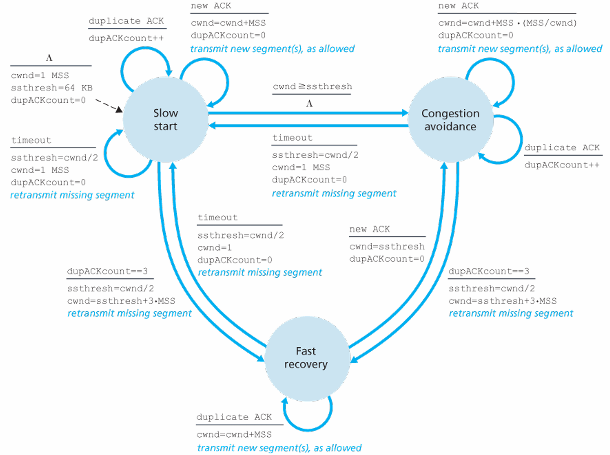