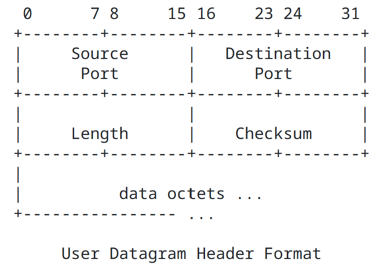
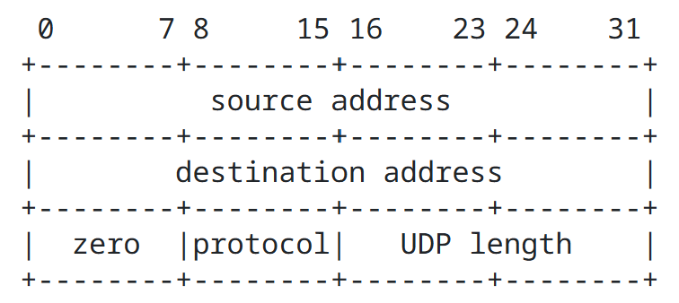

# UDP
   - UDP使用二元组设计, 是裸露于网络层协议上简单的通信方式, 但具备数据校验能力.

## 特性
   - 报文二元组: 目标ip,端口.
   - 服务端获取地址端口: `data, addr = socket.recvfrom(buffer_size)`.
   - 有校验位, 不握手, 不回执, 可以以任意速率发送不进行拥塞控制.
   - 适用于实时控制, 网络管理等环境.
   - UDP以简化的原则设计, 但依然能区分源ip及端口.

## 报文
   - 头部8字节, 一共4块结构, 每块占用2字节. Length包含udp报文头部. [RFC 768]
   
   - ip数据报不提供校验, 若网络层故障, 要使用传输层校验机制检测数据.

## 校验位
   - 计算流程: 伪头部 + UDP头部 + 数据, 每16-bit相加, 不足补0, 最后取反码得到.
   - 加法流程: 无符号整数相加, 进位向后传递, 最高位进位加回到结果中.
   - 伪头部组成: 源ip, 目的ip, 协议号(UDP协议号17), UDP长度.
   - 伪头部作用: 防止路由错误, 但不参与传输.
   - 检验流程: 按流程检验最后的结果是否为全1.
   

## 多播